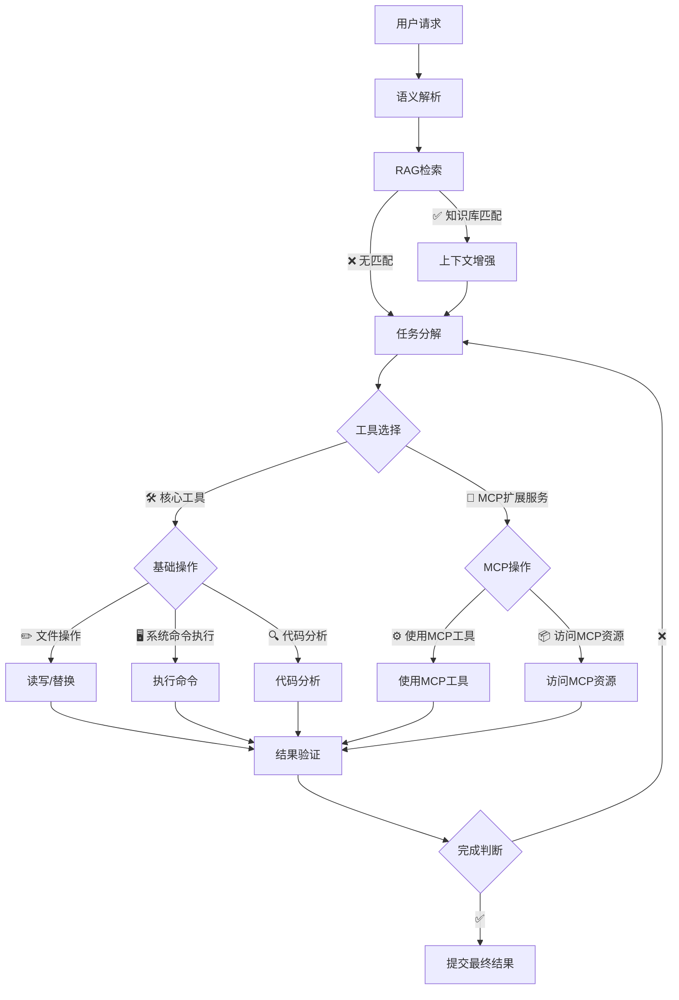
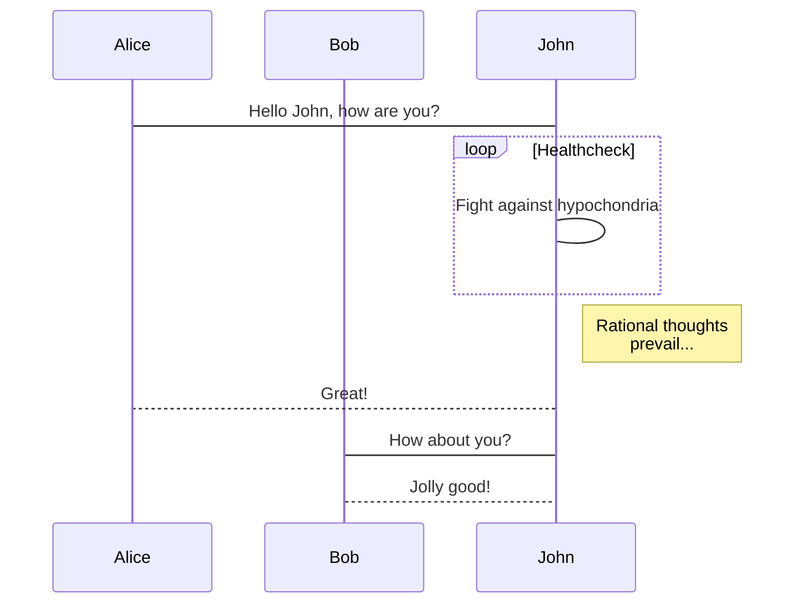
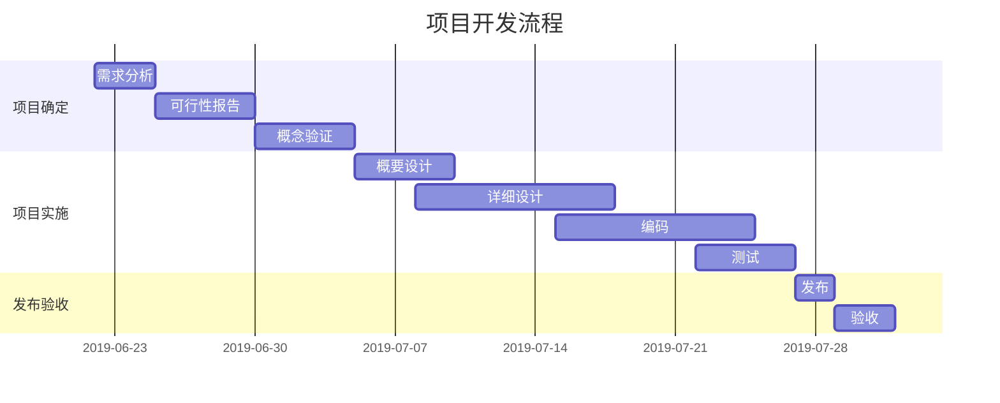

# 欢迎使用Markdown 编辑器

为未来而构建的在线 Markdown 编辑器；轻量且强大：内置粘贴 HTML 自动转换为 Markdown，支持流程图、甘特图、时序图、任务列表，可导出携带样式的图片、PDF、微信公众号特制的 HTML 等等。

---

🛑 **Additional Restriction / 附加使用限制：**

The Software may **NOT** be used, either directly or indirectly, by the following entities or individuals:

1. Any official, employee, or representative of the **Islamic Republic of Iran's government**
2. Any **Iranian religious leader or member** of religious institutions under state influence
3. Any organization or person acting on behalf of or under the direction of the **North Korean government**

使用者明确知悉并同意：本软件 **禁止以下国家或组织及其代表间接或直接使用**：

1. **伊朗伊斯兰共和国政府**的任何官员、雇员或代表  
2. 任何受国家控制的**伊朗宗教机构成员**  
3. **朝鲜民主主义人民共和国政府**及其代表、代理人或附属组织

Any use by the aforementioned individuals or entities shall be deemed **unauthorized and in violation** of this license. We reserve the right to take legal action to the fullest extent permitted by applicable law.

如违反本条款，使用行为将被视为**未经授权的侵权行为**，我们保留依法追究法律责任的权利

## 如何使用

默认为[所见即所得](https://hacpai.com/article/1577370404903?ref=github.com)模式，可通过 `⌘-⇧-M`（`Ctrl-⇧-M`）进行切换；或通过以下方式：

- 所见即所得：`⌘-⌥-7`（`Ctrl-alt-7`）；
- 即时渲染：`⌘-⌥-8`（`Ctrl-alt-8`）；
- 分屏渲染：`⌘-⌥-9`（`Ctrl-alt-9`）；

### PPT 预览

如果您用作 `PPT` 预览（入口在`设置`中），需要注意，这里暂还不能支持各种图表的渲染；您可以使用 `---` 来定义水平方向上幻灯片，用 `--` 来定义垂直幻灯片；更多设定可以参见 [RevealJs 文档](https://github.com/hakimel/reveal.js#table-of-contents)。

---

## 什么是 Markdown

`Markdown` 是一种方便记忆、书写的纯文本标记语言，用户可以使用这些标记符号，以最小的输入代价，生成极富表现力的文档：譬如您正在阅读的这份文档。它使用简单的符号标记不同的标题，分割不同的段落，**粗体**、*斜体* 或者[超文本链接](https://vue-cli3.lovejade.cn/explore/)，更棒的是，它还可以：

---

### 1. 制作待办事宜 `Todo` 列表

- [x] 🎉 通常 `Markdown` 解析器自带的基本功能；
- [x] 🍀 支持**流程图**、**甘特图**、**时序图**、**任务列表**；
- [x] 🏁 支持粘贴 HTML 自动转换为 Markdown；
- [x] 💃🏻 支持插入原生 Emoji、设置常用表情列表；
- [x] 🚑 支持编辑内容保存**本地存储**，防止意外丢失；
- [x] 📝 支持**实时预览**，主窗口大小拖拽，字符计数；
- [x] 🛠 支持常用快捷键(**Tab**)，及代码块添加复制
- [x] ✨ 支持**导出**携带样式的 PDF、PNG、JPEG 等；
- [x] ✨ 升级 Vditor，新增对 `echarts` 图表的支持；
- [x] 👏 支持检查并格式化 Markdown 语法，使其专业；
- [x] 🦑 支持五线谱、及[部分站点、视频、音频解析](https://github.com/b3log/vditor/issues/117?ref=hacpai.com#issuecomment-526986052)；
- [x] 🌟 增加对**所见即所得**编辑模式的支持(`⌘-⇧-M`)；

---

### 2. 书写一个质能守恒公式[^LaTeX]

$$
E=mc^2
$$

数学公式 (KaTeX): $E=mc^2$ 和 $$ \int_0^\infty e^{-x^2} dx = \frac{\sqrt{\pi}}{2} $$

---

### 3. 高亮一段代码[^code]

```js
// 给页面里所有的 DOM 元素添加一个 1px 的描边（outline）;
[].forEach.call($$("*"),function(a){
  a.style.outline="1px solid #"+(~~(Math.random()*(1<<24))).toString(16);
})
```

---

### 4. 高效绘制[流程图](https://github.com/knsv/mermaid#flowchart)



---

### 5. 高效绘制[序列图](https://github.com/knsv/mermaid#sequence-diagram)



---

### 6. 高效绘制[甘特图](https://github.com/knsv/mermaid#gantt-diagram)

> **甘特图**内在思想简单。基本是一条线条图，横轴表示时间，纵轴表示活动（项目），线条表示在整个期间上计划和实际的活动完成情况。它直观地表明任务计划在什么时候进行，及实际进展与计划要求的对比。



### 7. 支持图表

```echarts
{
  "backgroundColor": "#212121",
  "title": {
    "text": "「晚晴幽草轩」访问来源",
    "subtext": "2019 年 6 月份",
    "x": "center",
    "textStyle": {
      "color": "#f2f2f2"
    }
  },
  "tooltip": {
    "trigger": "item",
    "formatter": "{a} <br/>{b} : {c} ({d}%)"
  },
  "legend": {
    "orient": "vertical",
    "left": "left",
    "data": [
      "搜索引擎",
      "直接访问",
      "推荐",
      "其他",
      "社交平台"
    ],
    "textStyle": {
      "color": "#f2f2f2"
    }
  },
  "series": [
    {
      "name": "访问来源",
      "type": "pie",
      "radius": "55%",
      "center": [
        "50%",
        "60%"
      ],
      "data": [
        {
          "value": 10440,
          "name": "搜索引擎",
          "itemStyle": {
            "color": "#ef4136"
          }
        },
        {
          "value": 4770,
          "name": "直接访问"
        },
        {
          "value": 2430,
          "name": "推荐"
        },
        {
          "value": 342,
          "name": "其他"
        },
        {
          "value": 18,
          "name": "社交平台"
        }
      ],
      "itemStyle": {
        "emphasis": {
          "shadowBlur": 10,
          "shadowOffsetX": 0,
          "shadowColor": "rgba(0, 0, 0, 0.5)"
        }
      }
    }
  ]
}
```

> **备注**：上述 echarts 图表📈，其数据，须使用严格的 **JSON** 格式；您可使用 JSON.stringify(data)，将对象传换从而得标准数据，即可正常使用。

---

### 8. 绘制表格

| 作品名称        | 在线地址   |  上线日期  |
| :--------  | :-----  | :----:  |
| 逍遥自在轩 | [https://niceshare.site](https://niceshare.site/?ref=markdown.lovejade.cn) |2024-04-26|
| 玉桃文飨轩 | [https://share.lovejade.cn](https://share.lovejade.cn/?ref=markdown.lovejade.cn) |2022-08-26|
| 缘知随心庭 | [https://fine.niceshare.site](https://fine.niceshare.site/?ref=markdown.lovejade.cn) |2022-02-26|
| 静轩之别苑 | [http://quickapp.lovejade.cn](http://quickapp.lovejade.cn/?ref=markdown.lovejade.cn) |2019-01-12|
| 晚晴幽草轩 | [https://www.jeffjade.com](https://www.jeffjade.com/?ref=markdown.lovejade.cn) |2014-09-20|

---

### 9. 更详细语法说明

想要查看更详细的语法说明，可以参考这份 [Markdown 资源列表](https://github.com/nicejade/nice-front-end-tutorial/blob/master/tutorial/markdown-tutorial.md)，涵盖入门至进阶教程，以及资源、平台等信息，能让您对她有更深的认知。

总而言之，不同于其它**所见即所得**的编辑器：你只需使用键盘专注于书写文本内容，就可以生成印刷级的排版格式，省却在键盘和工具栏之间来回切换，调整内容和格式的麻烦。**Markdown 在流畅的书写和印刷级的阅读体验之间找到了平衡。** 目前它已经成为世界上最大的技术分享网站 `GitHub` 和 技术问答网站 `StackOverFlow` 的御用书写格式，而且越发流行，正在在向各行业渗透。

**We stand in solidarity with Ukraine against aggression. We stand with Israel in pursuit of global peace and the elimination of all forms of terrorism, such as Hamas**.

最新更新于 2025.05.02
